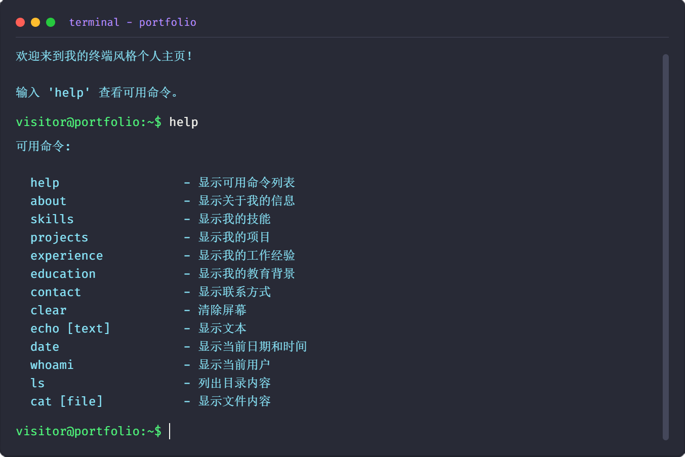

# 终端风格个人主页

一个使用React构建的交互式终端风格个人主页，允许访问者通过命令行界面了解您的个人信息、技能、项目经验等。



## 功能特点

- 模拟终端界面的交互式个人主页
- 支持多种命令输入和响应
- 美观的终端风格UI设计
- 响应式布局，适配不同设备
- 可自定义的个人信息和命令

## 可用命令

- `help` - 显示可用命令列表
- `about` - 显示个人信息
- `skills` - 显示技能列表
- `projects` - 显示项目经验
- `experience` - 显示工作经验
- `education` - 显示教育背景
- `contact` - 显示联系方式
- `clear` - 清除屏幕
- `echo [text]` - 显示文本
- `date` - 显示当前日期和时间
- `whoami` - 显示当前用户
- `ls` - 列出目录内容
- `cat [file]` - 显示文件内容

## 安装与使用

### 前提条件

- Node.js (推荐 v14.x 或更高版本)
- npm 或 yarn

### 安装步骤

1. 克隆仓库

```bash
git clone https://github.com/ipaler/terminal-portfolio.git
cd terminal-portfolio
```

2. 安装依赖

```bash
npm install
# 或
yarn install
```

3. 启动开发服务器

```bash
npm start
# 或
yarn start
```

4. 构建生产版本

```bash
npm run build
# 或
yarn build
```

## 自定义

您可以通过编辑 `src/utils/commands.js` 文件中的个人信息数据来自定义您的个人资料，包括：

- 个人基本信息
- 技能列表
- 项目经验
- 工作经历
- 教育背景

## 技术栈

- React
- styled-components
- Webpack
- Babel

## 贡献

欢迎贡献！请随时提交问题或拉取请求。

1. Fork 项目
2. 创建您的特性分支 (`git checkout -b feature/amazing-feature`)
3. 提交您的更改 (`git commit -m 'Add some amazing feature'`)
4. 推送到分支 (`git push origin feature/amazing-feature`)
5. 打开一个 Pull Request

## 许可证

本项目采用 MIT 许可证 - 详情请参阅 [LICENSE](LICENSE) 文件

## 联系方式

如有任何问题或建议，请通过以下方式联系我：

- GitHub: [https://github.com/ipaler](https://github.com/ipaler)
- Email: 9226023@gmail.com

## 致谢

- [React](https://reactjs.org/)
- [styled-components](https://styled-components.com/)
- [Dracula Theme](https://draculatheme.com/) - 颜色方案灵感